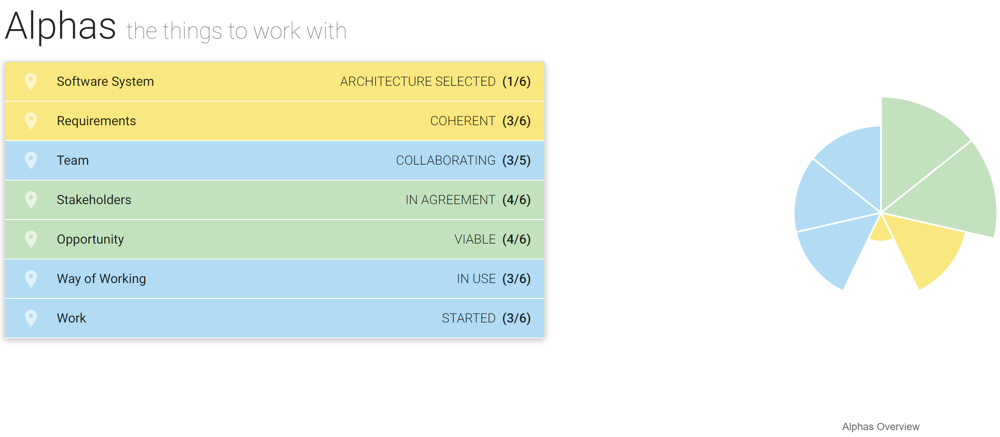
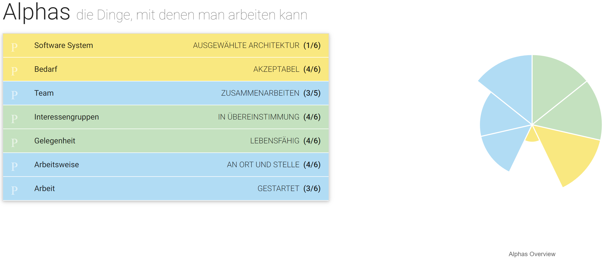

= Projektplan: E2 Anwesenheitserfassung Modellflugplatz
Tsatsralterdene Batchimeg <tsatsralterdene.batchimeg@htw-dresden.de>; Max Haufe <max.haufe@htw-dresden.de>; Alexander Heiß <alexander.heiss@htw-dresden.de>; Simon Herbstrith <simon.herbstrith@htw-dresden.de>; Richard Kleint <richard.kleint@htw-dresden.de>; Jakob Laufer <jakob.laufer@htw-dresden.de>; Lenny Reitz <lenny.reitz@htw-dresden.de>; Dirk Zimmermann <dirk.zimmermann@htw-dresden.de>
{localdatetime}
include::../_includes/default-attributes.inc.adoc[]
// Platzhalter für weitere Dokumenten-Attribute

== Einführung
In diesem Dokument werden die Organisationsstrukturen, die allgemeinen Ziele, insbesondere die der Iterationen sowie die Teamverantwortlichkeiten festgehalten.

== Projektorganisation
Die Durchführung des Projektes geschieht im Zeitraum von November 2020 bis zum Ende des Sommersemesters 2021, voraussichtlich Mai/Juni. Es werden folgende Arbeitsbereiche festgelegt: Analyse, Entwurf, Implementierung, Test, Projektmanagement.

Den Projektteilhabern werden folgende Aufgabenbereiche zugeteilt:

* Projektmanagement: Simon
* Analyse: Jakob, Richard, Tsatsra
* Entwurf: Technisch: Max, Dirk, Lenny; Webdesign: Alexander
* Implementierung: Max, Dirk, Lenny
* Test: Alexander

Die Kommunikation findet über eine für dieses Projekt erstellte WhatsApp-Gruppe statt. Teammeetings finden nach gemeinsamer Terminfindung per WhatsApp auf dem Projekt-Discord-Server "SE I Projekt" statt. Der Discord-Server bietet die Möglichkeit des einfachen Transfers von Dateien, die nicht für das im Folgenden erläuterte GitHub-Repository geeignet oder lediglich temporär zur teaminternen Bearbeitung notwendig sind.

Als Arbeitsumgebung wird ein GitHub-Repository verwendet, zu dem alle Teammitglieder sowie der Coach hinzugefügt sind.

Die Projektbeschreibung ist bei gegebener Berechtigung unter https://bildungsportal.sachsen.de/opal/auth/RepositoryEntry/21511831560/CourseNode/100656047093265 erhältlich. Das Projekt ist gemäß Beschreibung als Nachfolger und Teilhaber des Projektes "Wetterstation" anzusehen. Die dort vorhandene technischen Strukturen sowie Projektinhalte sind unter <<Erste_Fragen.adoc>> aufgelistet.

//Introduce the project team, team members, and roles that they play during this project. If applicable, introduce work areas, domains, or technical work packages that are assigned to team members. Introduce neighboring projects, relationships, and communication channels. If the project is introduced somewhere else, reference that location with a link.

== Praktiken und Bewertung

Als Grundlage wird das Prinzip der iterativ inkrementellen Softwareentwicklung verwendet. Die Iterationen werden überwiegend eine Länge von zwei Wochen aufweisen. In jeder dieser Iterationen findet eine Gesamtteambesprechung  mit einem Rückblick auf die Erfolge sowie Schwierigkeiten der letzten Iteration statt. Des Weiteren wird die nächste Iteration in ihrer Gesamtheit geplant und Fragen zum Projekt geklärt.

Zusätzlich findet innerhalb jedes Zykluses ein Meeting mit dem Kunden statt. Diesem werden die  Erfolge in aufbereiteter Form vorgelegt sowie Unklarheiten oder Fragen zur Beantwortung nähergebracht. In diesen Konferenzen nehmen die Teammitglieder je nach Bedarf teil. Der Teammanager sollte aber bei Möglichkeit als Ansprechpartner bei jedem Treffen teilnehmen.

Zur Zyklusplanung werden Iteration Plans verwendet. Die dort eingefügten Elemente stammen aus dem erstellten GitHub Repository und sind ihrer Priorität nach in der nächsten Iteration zu planen. Das GitHub-Repository ist unter https://github.com/simonherbstrith/E2-Anwesenheitserfassung-fuer-Modellflugplatz/ zu finden.

Für die Analyse und weitere Bearbeitung werden Use-Cases erstellt

Zudem wird eine Risikoanalyse zur Feststellung der wichtigsten Schwierigkeiten, deren Eintrittswahrscheinlichkeit sowie Projekteinfluss erstellt. Des Weiteren wird ein Test-Case-Dokument die theoretisch auftretenden Probleme der (technischen) Umsetzung bereits zum Analyse- und Entwurfzeitpunkt auflisten.

Zum Festhalten des Status der Projektarbeit wird "Essence" verwendet. 
//Describe or reference which management and technical practices will be used in the project, such as iterative development, continuous integration, independent testing and list any changes or particular configuration to the project. Specify how you will track progress in each practice. As an example, for iterative development the team may decide to use iteration assessments and iteration burndown reports and collect metrics such as velocity (completed work item points/ iteration).

== Meilesteine und Ziele
//Define and describe the high-level objectives for the iterations and define milestones. For example, use the following table to lay out the schedule. If needed you may group the iterations into phases and use a separate table for each phase

[%header, cols=4*]
|===
|Iteration
|Ziel
|Inhalte
|Zeitraum

|It. Nr. 1
|Inception - Übersicht erhalten
|Analyse, Erstbesprechung, Fortbildung, Vision/Glossary/Risikoanalyse bearbeiten
|KW 49-50

|It. Nr. 2
|Vorläufige Fertigstellung Inception (Milestone), Beginn Elaboration
|Vorläufige Fertigstellung der Analyse, Start des Entwurfs, Start des Designentwurfs, Use-Case-Entwicklung
|KW 51-53

|It. Nr. 3
|Fortführung Elaboration
|Weitere Bearbeitung  Use-Cases, Wireframes, Domänenmodell, System-Wide-Requirements, Architecture Notebook, Bedienungsplan, Use-Case-Diagramm, Testcases
|KW 1-2

|It. Nr. 4
|Vorläufige Fertigstellung Elaboration (Milestone)
|Weitere Bearbeitung/Anpassungen der It. Nr. 3 Aufgaben
|KW 3-5

|It. Nr. 5
|Construction
|
|KW 13-14

|It. Nr. 6
|Construction
|
|KW 15-16

|It. Nr. 7
|Construction
|
|KW 17-18

|It. Nr. 8
|Construction
|
|KW 19-20

|It. Nr. 9
|Transition & Tests
|
|KW 21-22

|It. Nr. 10
|Tests
|
|KW 23-24
|===

== Fortschritte nach Sim4Seed

Iteration 2:

.Fortschritt Iteration 2

Iteration 3:

.Fortschritt Iteration 3

//== Deployment
//Outline the strategy for deploying the software (and its updates) into the production environment.

== Erkenntnisse (Lessons learned)
* Bessere Meetingstrukturierung
* Frühzeitigere Bearbeitung der Dokumentationen
* Häufigere Teilnahme an SE Praktikas für Feedback & Tipps
* Einheitliche Begrifflichkeiten verwenden

